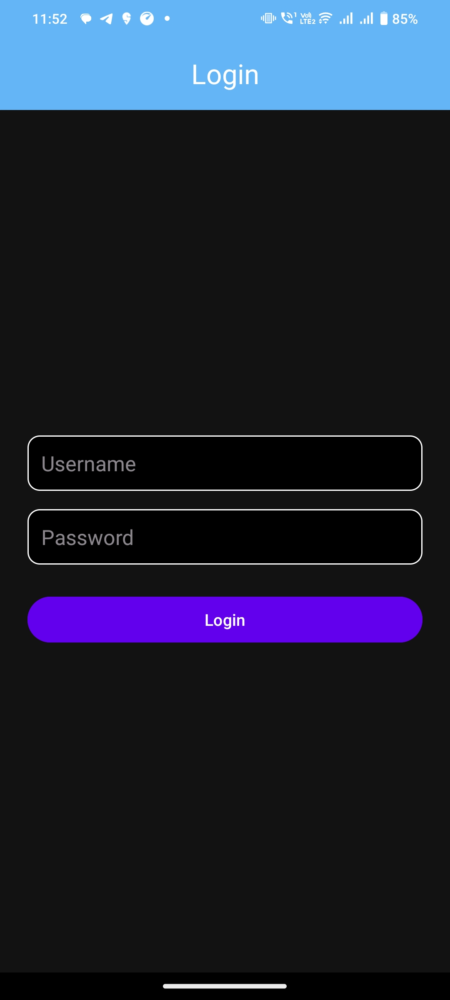
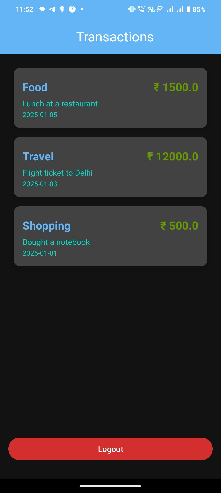

# My Android App - ApiTransactions

## 📌 Project Overview
This Android app demonstrates API integration by allowing users to log 
in and view a list of transactions. The app handles authentication and 
token-based API calls securely using Retrofit.


## 🛠️ Features
- Login with username and password
- Fetch transactions using authenticated API
- Display transactions in a RecyclerView
- Token management for secured requests
- Proper UI representation of transaction items
- Error handling and user-friendly messages


## Credentials for Login
- Username: admin
- Password: A7ge#hu&dt(wer


## 📸 Screenshots


### Profile Screen



## 🛠️ Tech Stack
- Java
- Android SDK
- Biometric Authentication
- API integration using Retrofit

## 🚀 Getting Started

### Prerequisites
- Android Studio (latest version recommended)
- Minimum SDK version: 24
- Internet connection (for Api)

### Installation and Build APK Instructions
1. Clone this repo:
   ```bash
   git clone https://github.com/ArunkumarThatikanti/task1-api-transactions.git

2. Open the Project in Android Studio
- Launch Android Studio.
- Choose "File > Open > Navigate to the folder you just cloned" or you can click on "file > new > project from version control > paste clone url".
- Go to Build > Build Bundle(s) / APK(s) > Build APK(s).
After the build completes, click "locate" to find the APK in:
 app/build/outputs/apk/debug/app-debug.apk
- you can add this apk to mobile device and install.

## 🚀 Bonus Feature
- Added dask mode (UI colors will change according to system theme). 